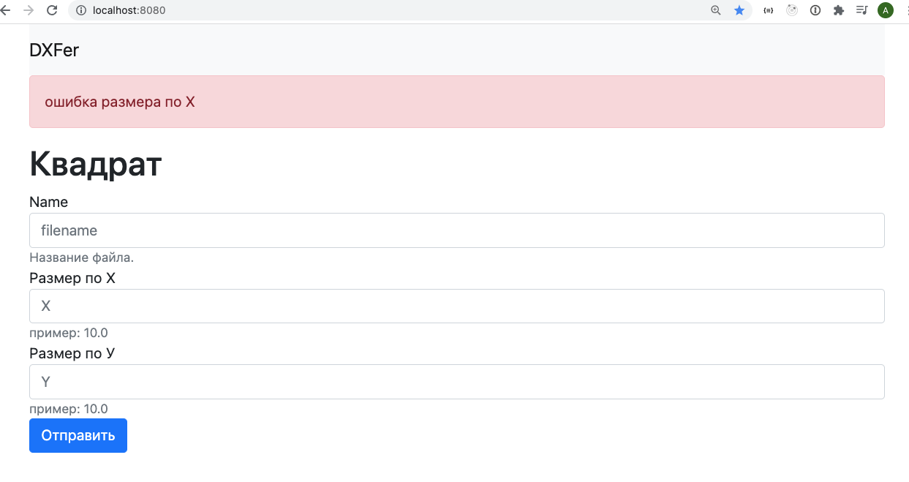

# DXFer
A simple web service to creating cutting blank dxf files.
## build
`make bin/dxfer`

## build for windows
```
make bin/dxfer.exe
```

## run
```
bin/dxfer
```

## use
```
open http://localhost:8080/
```

